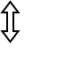

# Posy's Cursor for MacOS

[Posy's Improved Cursors](http://www.michieldb.nl/other/cursors/) ported to MacOS for [Mousecape](https://github.com/alexzielenski/Mousecape/releases)

<table>
  <tr>
    <td></td>
    <td></td>
    <td></td>
    <td></td>
    <td></td>
    <td></td>
    <td></td>
    <td></td>
    <td></td>
    <td></td>
    <td></td>
    <td></td>
    <td></td>
    <td></td>
    <td></td>
  </tr>
</table>

## Installation

1. To change your cursor in MacOS, install [Mousecape](https://github.com/alexzielenski/Mousecape/releases) (just download the latest `.zip` and install)

2. Download either [posy-cursor-original.cape](posy-cursor-original.cape) or [posy-cursor-with-copy.cape](posy-cursor-with-copy.cape)

3. Open `Mousecape`, hit `File` > `Import Cape` > select `posy-cursor.cape`

## Changes I Made

- Most of Posy's Cursors had roughly one-to-one drop-in replacements, but some don't quite fit

- Out of all of them, the `posy-alt` (second from right above) had the worst fit - it ended up being used for MacOS's Alias cursor

- Posy's Cursor pack didn't have a Copy Cursor, so I made a very simple one in GIMP (last cursor above)

  - If you do / don't like this cursor, you can use `posy-cursor-with-copy.cape` or `posy-cursor-original` respectively (original just has the default cursor instead)

## Some Stupid Tools I Used

- I used a couple of pretty dumb tools to convert all the `.cur`, `.ani`, and `.ico` files into `.png`s to use with `Mousecape`

### ani2ico.c

A script in C that converts each frame of a `.ani` file to a `.ico` file (source: [this archlinux forum post](https://bbs.archlinux.org/viewtopic.php?id=151153))

- Compile with:

```
gcc ani2ico.c -o ani2ico
```

- And run with:

```
/path/ani2ico /path/filename.ani
```

### Converting Windows cursor files into `.png`s

Using `ImageMagick`, convert the `.ico`s to `.png`s and stack them (source: [macrumors](https://forums.macrumors.com/threads/mousescape-0-0-5-1579.2061866/))

- To convert an `.ico` to a series of `.png`s:

```
magick mogrify -format png *.ico
```

- And to stack all `.png`s in a folder into one long `.png` "sprite-sheet"

```
magick convert * -append result.png
```

- Lastly, to convert `.cur` into `.png`:

```
magick convert input.cur output.png
```

Assuming the `.ani` and `.ico` files are in a seperate folder by themselves

### Sorting `.png`s before stacking them

- I wrote a very basic `for` bash script ([`animated-cursor.sh`](animated-cursor.sh)) to copy 24 of the `.png`s into a seperate folder before they get stacked (because MacOS only accepts 24fps animations)

### Making a `.gif` for `README.md`

- I put the individual `.png` frames into a seperate folder, then ran the following to convert the `.png`s to a `.gif` with frame interval .095s:

```
convert -alpha set -channel A -threshold 50% -background none -delay 9.5 -loop 0 *.png output.gif
```

## Stuff I'm too lazy to implement

- [ ] Half arrow cursors for resizing (see the [official Apple cursors](https://support.apple.com/guide/mac-help/pointers-in-macos-mh35695/mac))